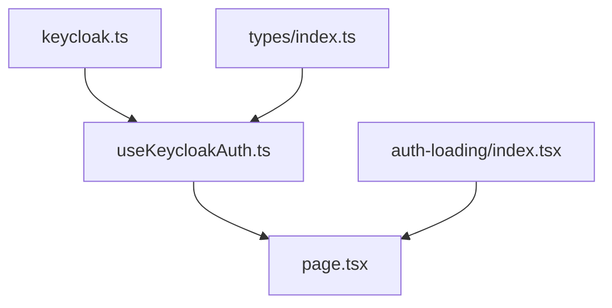

# Keycloak 认证集成工作记录 - 2024-03-27

## 1. 项目背景

在 Dify 聊天应用中集成 Keycloak 认证，实现用户访问聊天页面时的身份验证功能。主要目标是在用户访问共享聊天链接时，确保用户已通过 Keycloak 认证。

### 1.1 技术选型
- **前端框架**: Next.js 13+
- **认证服务**: Keycloak 22
- **状态管理**: React Hooks
- **存储方式**: LocalStorage
- **开发语言**: TypeScript

## 2. 文件变更记录

### 2.1 新增文件

1. **配置文件**
   ```
   /app/config/keycloak.ts
   ```
   - 用途：存储 Keycloak 配置信息和日志工具
   - 主要内容：
     ```typescript
     // Keycloak 配置对象
     export const KEYCLOAK_CONFIG = {
       url: 'http://192.168.1.194:8081',
       realm: 'AI',
       clientId: 'AI-Client',
       clientSecret: '...'
     }

     // 日志工具函数
     export const logKeycloak = (message: string, data?: any) => {
       console.log('[Keycloak Debug]', message)
       if (data) {
         console.log('[Keycloak Data]', data)
       }
     }

     // 类型定义
     export interface KeycloakConfig {
       url: string
       realm: string
       clientId: string
       clientSecret: string
     }
     ```

2. **认证 Hook**
   ```
   /app/hooks/useKeycloakAuth.ts
   ```
   - 用途：管理认证状态和流程的自定义 Hook
   - 主要功能：
     ```typescript
     import { useState, useEffect, useCallback } from 'react'
     import { KEYCLOAK_CONFIG, logKeycloak } from '../config/keycloak'

     const TOKEN_KEY = 'remember_token'

     export const useKeycloakAuth = () => {
       // 状态定义
       const [isAuthenticated, setIsAuthenticated] = useState(false)
       const [isLoading, setIsLoading] = useState(false)
       const [error, setError] = useState<string | null>(null)

       // 认证成功处理
       const handleAuthSuccess = useCallback((token: string) => {
         localStorage.setItem(TOKEN_KEY, token)
         setIsAuthenticated(true)
         setIsLoading(false)
         setError(null)
       }, [])

       // 认证流程
       useEffect(() => {
         const checkAuth = async () => {
           try {
             // 检查本地token
             const token = localStorage.getItem(TOKEN_KEY)
             if (token) {
               handleAuthSuccess(token)
               return
             }

             // 处理认证回调
             const code = new URLSearchParams(window.location.search).get('code')
             if (code) {
               // Token 请求逻辑
               // ...
             } else {
               // 重定向到登录
               // ...
             }
           } catch (err) {
             // 错误处理
             // ...
           }
         }

         checkAuth()
       }, [handleAuthSuccess])

       return { isAuthenticated, isLoading, error }
     }
     ```

3. **加载组件**
   ```
   /app/components/base/auth-loading/index.tsx
   ```
   - 完整实现：
     ```typescript
     import React from 'react'
     import Loading from '../loading'

     const AuthLoading: React.FC = () => {
       return (
         <div className="flex flex-col items-center justify-center min-h-screen">
           <Loading />
           <p className="mt-4 text-gray-600">
             正在验证身份，请稍候...
           </p>
         </div>
       )
     }

     export default AuthLoading
     ```

### 2.2 修改文件

1. **聊天页面组件**
   ```
   /app/(shareLayout)/chat/[token]/page.tsx
   ```
   - 详细修改：
     ```typescript
     import { useKeycloakAuth } from '@/app/hooks/useKeycloakAuth'
     import AuthLoading from '@/app/components/base/auth-loading'

     export default function ChatPage() {
       const { isAuthenticated, isLoading, error } = useKeycloakAuth()

       // 处理认证状态
       if (isLoading) {
         return <AuthLoading />
       }

       if (error) {
         return <div className="error-message">{error}</div>
       }

       if (!isAuthenticated) {
         return null // 会自动重定向到登录页面
       }

       // 原有的聊天组件渲染
       return (
         <ChatComponent />
       )
     }
     ```

2. **类型定义文件**
   ```
   /app/types/index.ts
   ```
   - 新增类型：
     ```typescript
     export interface KeycloakAuthState {
       isAuthenticated: boolean
       isLoading: boolean
       error: string | null
     }

     export interface KeycloakTokenResponse {
       access_token: string
       expires_in: number
       refresh_token: string
       token_type: string
     }
     ```

### 2.3 文件依赖关系



## 3. 关键功能实现

### 3.1 认证流程详解

1. **初始化检查**
   ```typescript
   // 1. 检查本地token
   const token = localStorage.getItem(TOKEN_KEY)
   if (token) {
     handleAuthSuccess(token)
     return
   }

   // 2. 检查URL参数
   const code = new URLSearchParams(window.location.search).get('code')
   ```

2. **Token 获取流程**
   ```typescript
   // 构建token请求
   const params = new URLSearchParams()
   params.append('grant_type', 'authorization_code')
   params.append('client_id', KEYCLOAK_CONFIG.clientId)
   params.append('client_secret', KEYCLOAK_CONFIG.clientSecret)
   params.append('code', code)
   params.append('redirect_uri', window.location.origin + window.location.pathname)

   // 发送请求
   const response = await fetch(tokenEndpoint, {
     method: 'POST',
     headers: {
       'Content-Type': 'application/x-www-form-urlencoded',
     },
     body: params,
   })
   ```

3. **错误处理机制**
   ```typescript
   try {
     // 认证逻辑
   } catch (err) {
     const errorMessage = err instanceof Error ? err.message : '认证失败'
     logKeycloak('认证错误', { error: errorMessage })
     setError(errorMessage)
     setIsAuthenticated(false)
     setIsLoading(false)
   }
   ```

### 3.2 状态管理详解

1. **认证状态转换**
   ```
   未认证 -> 加载中 -> 已认证/认证失败
   ```

2. **状态处理时机**
   - 组件挂载时
   - 认证码检测时
   - Token 获取成功/失败时
   - 错误发生时

## 4. 重要配置说明

### 4.1 Keycloak 配置详解
```typescript
export const KEYCLOAK_CONFIG = {
  // Keycloak 服务器地址
  url: 'http://192.168.1.194:8081',
  // 领域名称，对应 Keycloak 中的 Realm
  realm: 'AI',
  // 客户端ID，对应 Keycloak 中的 Client ID
  clientId: 'AI-Client',
  // 客户端密钥，从 Keycloak 客户端配置中获取
  clientSecret: '...'
}
```

### 4.2 存储配置
```typescript
// 与 Dify 保持一致的 token 存储 key
const TOKEN_KEY = 'remember_token'

// Token 存储格式
interface StoredToken {
  value: string
  expiresAt: number
}
```

## 5. 注意事项

1. **文件位置与命名规范**
   - 配置文件放在 `config` 目录
   - Hook 文件放在 `hooks` 目录
   - 组件文件放在 `components` 目录
   - 使用语义化命名

2. **代码兼容性考虑**
   - 使用 TypeScript 严格模式
   - 保持与 Dify 现有代码风格一致
   - 避免修改原有组件的核心逻辑

3. **安全性考虑**
   - Token 不明文打印到日志
   - 清理 URL 中的敏感参数
   - 使用 HTTPS 进行通信
   - 验证 token 的有效性

## 6. 调试信息

### 6.1 关键日志点
```typescript
// 认证开始
logKeycloak('开始认证流程')

// Token 获取
logKeycloak('获取token', { 
  token_preview: `${token.substring(0, 10)}...`,
  expires_in 
})

// 错误信息
logKeycloak('认证错误', { error })
```

### 6.2 常见问题处理
1. Token 获取失败
   - 检查认证码是否有效
   - 验证重定向 URI 是否匹配
   - 确认客户端密钥正确性

2. 页面加载问题
   - 检查认证状态管理
   - 验证组件渲染逻辑
   - 确认路由配置正确

## 7. 后续优化建议

1. **代码组织优化**
   - 创建专门的认证模块
   - 实现更完善的类型系统
   - 添加单元测试

2. **功能增强**
   - 实现 token 自动刷新
   - 添加记住登录状态
   - 优化错误提示
   - 实现优雅降级

3. **性能优化**
   - 减少不必要的重渲染
   - 优化状态更新逻辑
   - 实现懒加载

## 8. 参考文档

- [Keycloak 官方文档](https://www.keycloak.org/documentation)
- [Next.js 文档](https://nextjs.org/docs)
- [React Hooks 文档](https://reactjs.org/docs/hooks-intro.html)
- [TypeScript 文档](https://www.typescriptlang.org/docs)
- [OAuth 2.0 规范](https://oauth.net/2/) 